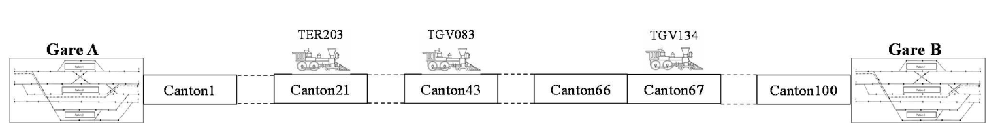

# Simulation of a Distributed Railway System - README

This project simulates a distributed railway system that operates on a line consisting of **100 sections** numbered from **1 to 100**. The system manages the movement of trains, each characterized by a unique identifier consisting of 3 letters and 3 digits, such as TGV134 and TER203. The primary goal of this system is to ensure the safety of railway operations by ensuring that only one train can occupy a section at any given time.



## System Components

The system comprises two main elements:

1. **Radio Block Center (RBC)**: This acts as the central server responsible for recording train movements as they enter the track, updating their positions, issuing movement authorizations, and maintaining information.

2. **Train Movements**: Trains act as clients in the system. Each train regularly sends its current position to the RBC and requests new movement authorizations.

To implement this system, we adopted a distributed approach based on a client-server architecture using TCP/IP communication. Additionally, an industrial messaging structure was developed to facilitate communication between clients (trains) and the server (RBC).

## Coding

### `railway.h` and `railway.c`

`railway.h` provides data structures and functions necessary for managing trains in the simulated railway system. It defines train types, structures for storing train information, and functions for creating, managing, and displaying train information.

### `server.h` and `server.c`

`server.h` declares functions and data structures for the server component of the system, while `server.c` contains the implementation of these functions. The server handles client connections, communication with trains, and overall system management.

### `client.c`

`client.c` represents the client component of the system, allowing users to send messages to the server, enabling communication and interaction between trains and the central control server.

### `main.c`

`main.c` is the central component of the system, simulating the Radio Block Center (RBC). It is responsible for starting the server, managing train connections, and controlling the entire system.

### `train.c`

`train.c` simulates a train driver's control panel, enabling users to control a simulated train and communicate with the server. It offers an interactive menu and supports commands to move the train and request information.

### `makefile`

The Makefile automates the compilation of the project. It defines rules for compiling the source files into executable programs. It includes rules for building both the train control program and the RBC program.

## Running the System

1. Compile the project using the provided Makefile:

   ```bash
   make
   ```

   This will generate the `train` and `rbc` executable files.

2. Start the Radio Block Center (RBC) by running:

   ```bash
   ./rbc
   ```

   This will initialize the central control server.

3. Start one or more train control panels by running:

   ```bash
   ./train
   ```

   You can run multiple train control panels to simulate multiple trains.

4. Use the interactive menus in the train control panels to control the simulated trains.

## Project Demonstration

The project includes a demonstration of its functionality. The following images showcase the setup, multiple connections to the RBC, active connections, and train control.

- Running the RBC (`./rbc`):

  

- Running a Train Control Panel (`./train`):

  

- Multiple Connections to the RBC:

  

- Active Connections to the RBC:

  

## Conclusion

In conclusion, this project successfully simulates a distributed railway system, from the client component to the central control server and the train control panel. Each component plays a crucial role in simulating and communicating within the railway system.

The project reinforced our knowledge of C programming and allowed us to explore advanced concepts such as sockets, threads, and inter-process communication. It demonstrated the importance of proper data structures when building efficient and scalable systems.

Overall, we are satisfied with the project's outcome and believe it significantly contributed to our programming, networking, and system experience. It has prepared us to tackle future challenges in programming and provided a deeper appreciation for the complexities involved in simulating real-world systems.
